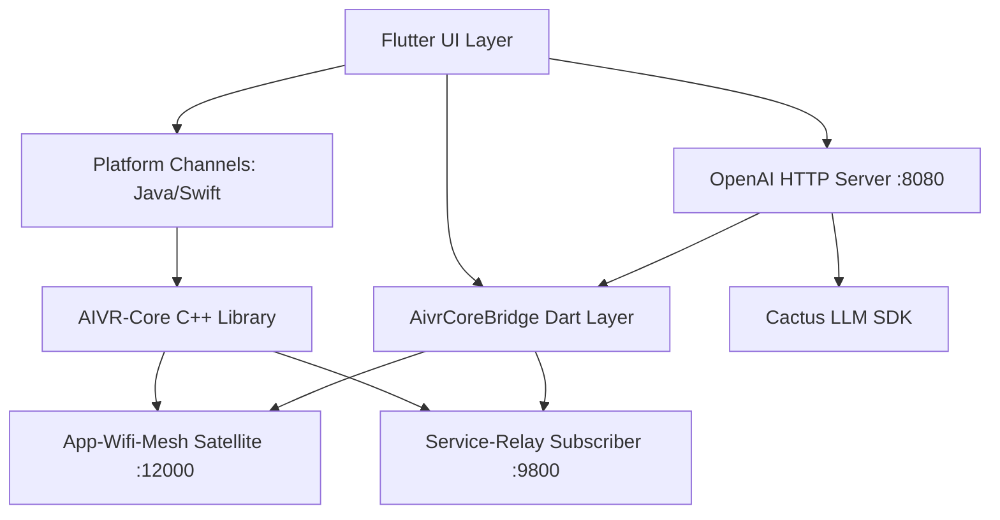

# AI-Mobile-Host — ARCHITECTURE.md

## 1. System Role: The "Body" (Mobile UI/Sensor) + AI Inference Node
**AIVR-AI-Mobile-Host** is the portal to the AIVR ecosystem on mobile devices (Android/iOS). It provides:
- The primary user interface for mobile interaction
- An OpenAI-compatible inference server (Cactus LLM)
- Bridges mobile hardware (GPS, IMU, Camera) into the C++ Axon bus
- Token/model relay to AIVR Core for earned credits and cross-node discovery

## 2. Component Topology


## 3. The Hybrid Flutter/C++ Model
The UI is built with **Flutter** for rapid iteration and cross-platform consistency. The business logic, networking, and P2P discovery are handled by the linked **AIVR-Core C++** library via FFI (Foreign Function Interface).

### 3.1 AIVR Core Bridge (New)
The `AivrCoreBridge` (Dart) and `mobile_bridge.cpp` (C++) together form the integration layer:

| Component | Role |
|-----------|------|
| `aivr_core_bridge.dart` | Dart service: mesh registration, heartbeat, token reporting |
| `mobile_bridge.cpp` | C++ FFI: node state, token aggregation, model relay |

**Lifecycle:**
1. `initialize()` — boot time, config load
2. `registerNode()` — UDP announce to mesh with model list
3. `reportTokens()` — per-request credit to orchestrator
4. `updateModels()` — advertise model changes
5. `deregisterNode()` — clean shutdown

## 4. OpenAI-Compatible API Layer
The server (shelf + shelf_router on `:8080`) exposes:

| Endpoint | Method | Purpose |
|----------|--------|---------|
| `/v1/chat/completions` | POST | Chat inference (streaming + non-streaming) |
| `/v1/models` | GET | List all downloaded models with metadata |
| `/v1/internal/devices` | GET | Compute unit discovery (NPU/GPU/CPU) |
| `/v1/internal/stats` | GET | Token counts, uptime, speed, AIVR node ID |
| `/` | GET | Health check with model/version/uptime |

**Auth:** Optional Bearer token middleware. Open (no auth) when no key configured.

**Token Flow:**
```
Request → Cactus LLM → Response
                ↓
        AivrCoreBridge.reportTokens()
                ↓
        UDP → Mesh (credit node) + Relay (aggregate stats)
```

## 5. Mobile Sensor Pipeline
Sensors (Accelerometers, Gyroscopes) are sampled at 60Hz and "Emitted" as binary vectors through the `App-Wifi-Mesh` to the PC Host for real-time tracking or gesture recognition.

## 6. Biometric Identity Bridge
On login, the app uses native FaceID/Fingerprint APIs. The resulting signature is verified by `Service-OAuth` during the initial handshake.

## 7. Communication: The Mobile Axon
Connects to the PC Host via Port 12000 (Mesh) and 9800 (Relay). Supports cellular fallback (via Relay Proxy) if the local Mesh is unreachable.

### 7.1 AIVR Core Mesh Protocol
- **Registration**: JSON payload via UDP to Port 12000 on server start
- **Heartbeat**: Every 30s via UDP to Port 9800 (stats, uptime, token speed)
- **Token Report**: Fire-and-forget UDP after each inference request
- **Model Update**: Broadcast when models are downloaded/deleted
- **Deregistration**: UDP notify on server stop

## 8. State Machine (Mobile Flow)
- `DISCONNECTED`: Awaiting discovery.
- `SEARCHING`: Scanning local Wi-Fi for PC Host.
- `CONNECTED`: Sensors streaming, UI active.
- `SERVING`: OpenAI server running, accepting inference requests.
- `BACKGROUND`: UI hibernated, server still active (wake lock enabled).

## 9. Implementation Detail: Native Plugins
- **Android:** JNI (Java Native Interface) bridge.
- **iOS:** Objective-C++ wrapper for the AIVR core.
- **C++ FFI:** `mobile_bridge.cpp` exports `aivr_register_node`, `aivr_report_tokens`, `aivr_get_node_health`, etc.

## 10. Links
- [Plugin API](../docs/API_SPEC.md)
- [Sensor Schema](../docs/SCHEMA.md)
- [Security](../docs/SECURITY.md)
