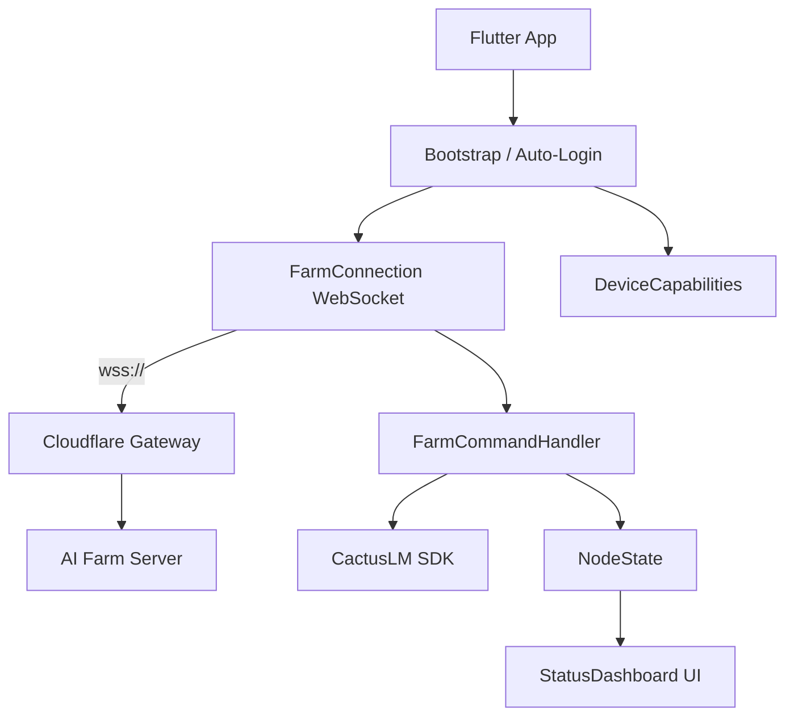

# AIVR - Node — ARCHITECTURE.md

## 1. System Role: Dedicated AI Inference Worker

**AIVR - Node** is a headless worker that connects to the AIVR AI Farm via Cloudflare gateway. It does one thing: run LLM inference on mobile hardware and earn tokens.

The user installs the app, it auto-connects to the farm, and the farm controls everything from there: which model to download, when to load it, and what inference requests to serve.

## 2. Token Economy

Users earn tokens by contributing device compute to the farm:
- **Earning**: Every inference request processed earns tokens (95% of total tokens processed)
- **Spending**: Earned tokens can be used on the user's own AI system
- **Trading**: Tokens can be bought/sold on the token exchange

## 3. Component Topology



## 4. Connection Flow

```
App Start
  → Generate/load persistent node ID
  → Gather device capabilities (CPU, RAM, storage)
  → Connect WebSocket to wss://farm.aivr.ai/ws/node?node_id=...
  → Send node_hello (capabilities, downloaded models)
  → Start 15s heartbeat
  → Wait for commands
```

Auto-reconnect on disconnect: 1s → 2s → 4s → 8s → 16s → 32s (max).

## 5. Command Protocol

All messages are JSON over WebSocket.

### Farm → Node (Commands)

| Command | Payload | Action |
|---------|---------|--------|
| `download_model` | `{model_id, download_url}` | Download GGUF weights |
| `load_model` | `{model_id, context_size}` | Initialize model for inference |
| `unload_model` | `{}` | Free model from memory |
| `delete_model` | `{model_id}` | Remove weights from storage |
| `inference` | `{request_id, messages[], stream, temperature, max_tokens}` | Run chat completion |
| `report_status` | `{}` | Return full status snapshot |

### Node → Farm (Responses)

| Message Type | Purpose |
|-------------|---------|
| `node_hello` | Registration with capabilities |
| `heartbeat` | 15s stats update |
| `command_result` | Success/error for any command |
| `inference_chunk` | Streaming token (per chunk) |
| `inference_complete` | Final response + usage stats |
| `token_report` | Per-request token credit |
| `download_progress` | Model download progress |
| `node_goodbye` | Clean disconnect |

## 6. File Structure

```
.mobile/lib/
  main.dart                    -- App shell, bootstrap, auto-connect
  node_state.dart              -- ChangeNotifier: single source of truth
  farm_connection.dart         -- WebSocket client, heartbeat, reconnect
  farm_command_handler.dart    -- Command dispatch, inference execution
  device_capabilities.dart     -- Hardware profiling for farm routing
  models.dart                  -- Minimal ModelInfo (farm-controlled)
  screens/
    status_dashboard.dart      -- Read-only status UI
```

## 7. What Was Removed

- Agent chat tab (no local chat)
- Model picker UI (farm controls models)
- Sensor tab (not needed for inference)
- Local HTTP server (shelf) — inference goes through WebSocket, not HTTP
- Manual model download — farm commands downloads
- OpenAI API endpoints — farm proxies these to clients
- UDP mesh registration — replaced by WebSocket to Cloudflare

## 8. Platform Support

| Platform | Status | Compute | Mode |
|----------|--------|---------|------|
| Android | Supported | Qualcomm NPU/Adreno GPU/ARM CPU | Flutter GUI + wake lock |
| iOS | Planned | Apple Neural Engine | Flutter GUI |
| Windows | Supported | Intel NPU, NVIDIA/AMD GPU, CPU | Flutter GUI or headless CLI |
| macOS | Supported | Apple Neural Engine / Metal | Flutter GUI or headless CLI |
| Linux | Supported | NVIDIA GPU, Intel NPU, CPU | Flutter GUI or headless CLI |

### Desktop Modes

**Flutter GUI** — Same status dashboard as mobile, runs as a desktop window:
```bash
flutter run -d windows   # or macos, linux
```

**Headless CLI** — No GUI, pure terminal. For servers, Docker, systemd:
```bash
dart run lib/main_headless.dart
dart run lib/main_headless.dart --farm-url wss://custom.farm/ws/node
AIVR_FARM_URL=wss://... dart run lib/main_headless.dart
```

Headless mode handles SIGINT/SIGTERM for clean shutdown in systemd/Docker.

## 9. Optimal Token Throughput

- **Wake lock** (mobile): Device never sleeps during inference
- **Foreground service** (Android): OS won't kill the process
- **Battery optimization bypass** (Android): Requested on install
- **Headless mode** (desktop): No GUI overhead, pure inference
- **NPU-first**: Auto-detects best compute unit per platform
- **Sequential queue**: Commands processed one at a time to avoid OOM
- **Auto-reconnect**: Never misses farm commands

## 10. Device Capability Detection

The node auto-detects hardware on every platform and reports to the farm:

| Platform | RAM | GPU/NPU Detection |
|----------|-----|-------------------|
| Android | `/proc/meminfo` | sysfs: Hexagon NPU, Adreno, Mali |
| Linux | `/proc/meminfo` | `nvidia-smi`, `/sys/class/accel`, `lspci` |
| macOS | `sysctl hw.memsize` | `sysctl hw.optional.arm64` (Apple Silicon = ANE) |
| Windows | `wmic ComputerSystem` | `wmic Win32_PnPEntity` (NPU), `Win32_VideoController` (GPU) |
